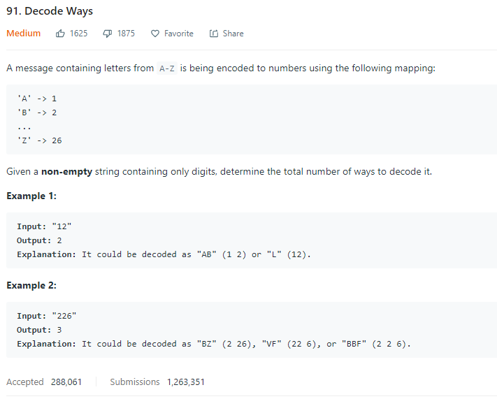

### Question



### [Initial idea](91_decode_ways.md#python-code-for-the-initial-idea)

Loop through the string and look for possible ways of decoding:
  - if digit > 2: only one possible way of decoding
  - if digit = 2: one possibility if the following digit is 0 or >= 7; two possibilities if the following digit is 1 ~ 6 
  - if digit = 1: one possibility if the follwoing digit is 0; two possibilities otherwise
  - if digit = 0: unless 0 is following 1 or 2, we should return 0 as there's no way of decoding
  
Can ultilize recursion to calculate number of possibilities for the rest of the string.

**Issue**

 - It's hard to stop when we encounter invalid "0"s in between.
 - Recursion is not necessary / feasible to implemented since the whole string can be invalid

### Improved idea

Instead of using "recursion" to get number of ways of decoding `s[i:]`, we calculate it and store it in a string with length equals to `len(s) + 1`.

**Issue**

s[i+1:] may be indexing out of range.


### Improved idea *Ver 2.0*

Calculate number of ways of decoding from back to the front. s[i-1] will not cause any indexing issue.

Code:

```Python
class Solution:
    def numDecodings(self, s):
        answer = [0]*(len(s)+1)
        
        if 0 < int(s[0]) <= 9:
            answer[0] = 1
        else:
            answer[0] = 0
            
        answer[-1] = 1
        
        for i in range(1, len(s)):
            if answer[i-1] == 0:
                return(0)
            else:
                if 0 < int(s[i]) <= 9:
                    answer[i] += answer[i-1]
                else:
                    answer[i] += 0
                    
                if 10 <= int(s[i-1:i+1]) <= 26:
                    answer[i] += answer[i-2]
                else:
                    answer[i] += 0
        return(answer[-2])
```

### Improved code

For faster code with the same idea see Appendix [faster code](91_decode_ways.md#faster-code).

For simpler code with the same idea see Appendix [simpler code](91_decode_ways.md#simpler-code).

### Appendix

#### Python code for the initial idea

Didn't pass the tests due to exceeded time limit.

```Python
class Solution:
    def numDecodings(self, s):
        if "0" in s:
            idx = s.index("0")
            if idx == 0 or s[idx-1] == "0" or s[idx-1] > "2":
                return(0)
        
        if len(s) < 1 or s[0] == "0":
            return(0)
        elif len(s) == 1:
            return(1)
        elif len(s) == 2:
            if s < "27" and s != "10" and s != "20":
                return(2)
            else:
                return(1)
        else:
            answer = 0
            if s[0] == "0":
                answer = self.numDecodings(s[1:])
            elif s[0] == "1":
                if s[1] == "0":
                    answer += self.numDecodings(s[2:])
                else:
                    answer += self.numDecodings(s[1:]) + self.numDecodings(s[2:])
            elif s[0] == "2":
                if s[1] == "0":
                    answer += self.numDecodings(s[2:])
                elif s[1] < "7":
                    answer += self.numDecodings(s[1:]) + self.numDecodings(s[2:])
                elif s[1] >= "7":
                    answer += self.numDecodings(s[1:])
            else:
                answer += self.numDecodings(s[1:])
            return(answer)
```

#### faster code

```Python
class Solution:
    def numDecodings(self, s):
        if s == "":
            return(0)
        n = len(s)
        
        answer = [0 for i in range(len(s) + 1)]
        answer[0] = 1
        for i in range(1, n + 1):
            if s[i - 1] != '0':
                answer[i] += answer[i - 1]

            if i != 1 and s[i-2:i] < "27" and s[i-2:i] > "09":
                answer[i] += answer[i - 2]
        
        return(answer[len(s)])
```

#### simpler code

```Python
class Solution:
    def numDecodings(self, s):
        previous_ans, answer, previous_ch = 0, int(s>''), ''
        for ch in s:
            previous_ans, answer, previous_ch = answer, (ch > '0') * answer + (9 < int(previous_ch + ch) < 27) * previous_ans, ch

        return(answer)
```
